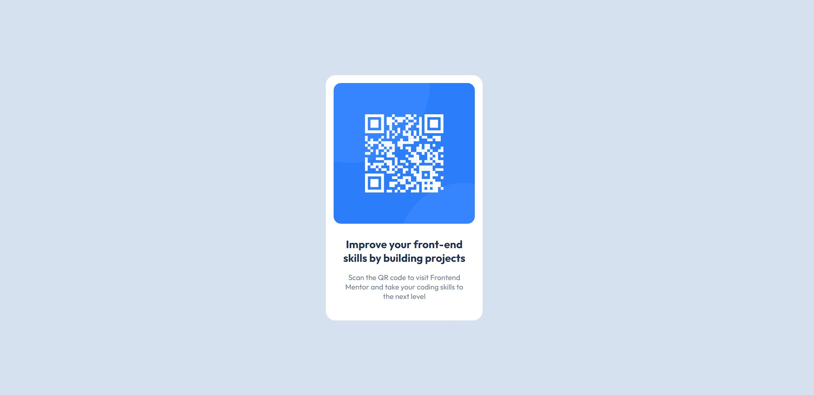

# Frontend Mentor - QR code component solution

This is a solution to the [QR code component challenge on Frontend Mentor](https://www.frontendmentor.io/challenges/qr-code-component-iux_sIO_H). Frontend Mentor challenges help you improve your coding skills by building realistic projects. 

## Table of contents

- [Overview](#overview)
  - [Screenshot](#screenshot)
  - [Links](#links)
- [My process](#my-process)
  - [Built with](#built-with)
  - [What I learned](#what-i-learned)
  - [Continued development](#continued-development)
  - [Useful resources](#useful-resources)
- [Author](#author)
- [Acknowledgments](#acknowledgments)

**Note: Delete this note and update the table of contents based on what sections you keep.**

## Overview

### Screenshot




### Links

- Solution URL: [Add solution URL here](https://your-solution-url.com)
- Live Site URL: [Add live site URL here](https://your-live-site-url.com)

## My process

### Built with

- Semantic HTML5 markup
- CSS custom properties
- Flexbox
- Mobile-first workflow

### What I learned
How to use flexbox to center div block

```css
  .container {
  width: 100%;
  height: 100%;
  display: flex;
  justify-content: center;
  align-items: center;
}
```


### Useful resources

- [W3 Schools](https://www.w3schools.com/) - This helped me for using CSS properties like padding or flexbox.

## Author
- Frontend Mentor - [@longenty](https://www.frontendmentor.io/profile/longenty)
- Twitter - [@thienlong666](https://x.com/thienlong666)

